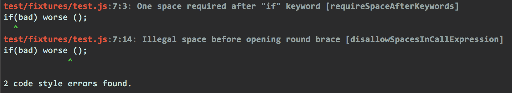

jscs-clang-reporter
===================

[![NPM version][npm-image]][npm-url] [![Build Status][travis-image]][travis-url]

This reporter for [JSCS](http://jscs.info) provides more concise output than the JSCS `console` reporter, but more information than the JSCS one-line reporters. The output is formatted and colored similar to the error output from `clang`.

Here is sample output in non-verbose mode and verbose mode (passing -v on command line):





## Installation

Install into your project with `npm` in the usual way:

`npm i jscs-clang-reporter`


## Usage

To use with JSCS, specify the path to the reporter on the command line:

`jscs -r node_modules/jscs-clang-reporter lib`

Note that the reporter will obey the `--no-colors` flag if it passed on the command line.

If you are using the reporter programmatically, for example with [gulp-jscs](https://www.npmjs.com/package/gulp-jscs), simply pass the same path:

```js
gulp.task("default", () => {
    return gulp.src("src/app.js")
        .pipe(jscs())
        .pipe(jscs.reporter("node_modules/jscs-clang-reporter"));
});
```


## Customization

If you using this reporter programmatically and the interface supports passing options to the reporter, you can configure the behavior of the reporter by passing an options object. There are two possible options, `colorize` and `colors`.


### colorize

If this property is set to a truthy value, the output of the reporter will be colorized, and not colorized otherwise.


### colors

You can use this property to customize the colors used by the reporter. If `colorize` is not truthy, this property is ignored.

By default, the elements of each error message are colorized with the following [chalk](https://github.com/chalk/chalk) colors (`null` means no colorizing):

Name      | Color
:-------  | :-----
file      | red.bold
location  | gray.bold
message   | gray.bold
separator | dim
source    | null
caret     | green.bold

A formatted error message has the following structure:

```
<file>:<location>: <message>
<source>
<caret>
```

The elements of the message are:

- **file** - The filename where the error occurred.
- **location** - The one-based line:column within the entire source where the issue occurred.
- **message** - The error message.
- **source** - The line of code within the file where the issue occurred.
- **caret** - `^` marks the position within `<source>` where the error occurred.
- **separator** - The ":" characters in the first line are colorized with the "separator" color in the color map.

You can customize these colors by passing your own color map in the `colors` options property. The map should be an object whose keys are one of the element names listed above, and whose values can either be strings or `chalk` functions. If you use strings, they should be the equivalent of the dotted `chalk` function, but without the "chalk." prefix.

Here are two equivalent color maps:

```js
{
    file: "bgBlue.yellow",
    location: "blue.underline",
    message: "bgGreen.bold",
    separator: "green",
    source: "inverse",
    caret: "cyan.bold"
}

{
    file: chalk.bgBlue.yellow,
    location: chalk.blue.underline,
    message: chalk.bgGreen.bold,
    separator: chalk.green,
    source: chalk.inverse,
    caret: chalk.cyan.bold
}
```

You do not need to set all of the values in the map if you only wish to override a few colors; only the elements whose keys are in the map will be affected. To turn off colorizing for an element, pass `null` as the value. Invalid element keys or styles will cause that item in the map to be ignored.

[npm-url]: https://npmjs.org/package/jscs-clang-reporter
[npm-image]: http://img.shields.io/npm/v/jscs-clang-reporter.svg?style=flat

[travis-url]: https://travis-ci.org/cappuccino/jscs-clang-reporter
[travis-image]: https://travis-ci.org/cappuccino/jscs-clang-reporter.svg?branch=master
