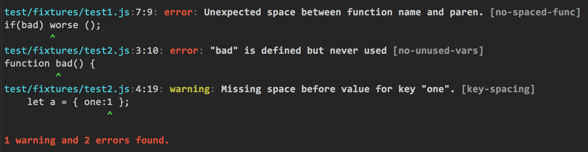

eslint-clang-formatter
======================

[![NPM version][npm-image]][npm-url] [![Build Status][travis-image]][travis-url]

This formatter for [ESLint](http://eslint.org) provides more informative output than the standard `eslint` formatters, and allows you to customize the colors used. The output is formatted similar to the error output from `clang`.

Here is sample output with the default colors:




## Installation

Install into your project with `npm` in the usual way:

```sh
npm i eslint-clang-formatter
```


## Usage

To use with JSCS, specify the path to the formatter on the command line:

```sh
eslint -f node_modules/eslint-clang-formatter lib
```

Note that the formatter will obey the `--no-color` flag if it passed on the command line.

If you are using the formatter programmatically, for example with [gulp-eslint](https://www.npmjs.com/package/gulp-eslint), simply pass the same path:

```js
gulp.task("lint", function () {
    return gulp.src(["lib/**/*.js"])
        .pipe(eslint())
        .pipe(eslint.format("node_modules/eslint-formatter", process.stdout))
        .pipe(eslint.failAfterError());
});
```


## Customization

You can configure the behavior of the formatter by creating a `.clangformatterrc` file in JSON format. The formatter searches for this file starting at the current working directory, then traversing up to the root of the filesystem. If the current user's home directory was not traversed, that is searched as well.

There are several possible properties in `.clangformatterrc`:


### colorize

Output is colorized by default, unless `--no-color` is passed on the command line. If colorizing was not disabled on the command line and this property is set to a boolean, this property will be used to determine colorizing.


### colors

Use this property to customize the colors used by the formatter. If colorization is off, this property is ignored.

By default, the elements of each error message are colorized with the following [chalk](https://github.com/chalk/chalk) colors (`null` means no colorizing):

Name      | Color
:-------  | :-----
file      | green.bold
location  | bold
error     | red.bold
warning   | yellow.bold
message   | bold
rule      | bold.dim
separator | dim
source    | null
caret     | magenta.bold

A formatted error message has the following structure:

```
<file>:<location>: <error|warning>: <message> <rule>
<source>
<caret>
```

The elements of the message are:

- **file** - The filename where the error occurred.
- **location** - The one-based line:column within the entire source where the issue occurred.
- **error | warning** - Either the text "error" or "warning", depending on the message type.
- **message** - The error message.
- **rule** - The name of the offending rule in `[]`.
- **source** - The line of code within the file where the issue occurred.
- **caret** - `^` marks the position within `<source>` where the error occurred.
- **separator** - The ":" characters in the first line are colorized with the "separator" color in the color map.

In addition to the messages, a summary is appended at the end. The color of the summary will "error" if there were errors, or "warning" if there were only warnings.

You can customize the colors by creating your own color map in the `colors` property. The map should be an object whose keys are one of the element names listed above, and whose values are the equivalent of the dotted `chalk` function, but without the "chalk." prefix.

Here is a sample color map:

```json
{
    "colors": {
        "file": "bgBlue.yellow",
	     "location": "blue.underline",
	     "separator": "green",
	     "error": "white.bold.bgRed",
	     "warning": "white.bold.bgYellow",
	     "message": "bgGreen.bold",
	     "source": "inverse",
	     "caret": "cyan.bold"
	 }
}
```

You do not need to set all of the values in the map if you only wish to override a few colors; only the elements whose keys are in the map will be affected. To turn off colorizing for an element, pass `null` as the value. Invalid element keys or styles will cause that item in the map to be ignored.


### showRule

By default, the offending rule name is shown after the error message. If this property is present and is `false`, the rule name is not displayed.


[npm-url]: https://npmjs.org/package/eslint-clang-formatter
[npm-image]: http://img.shields.io/npm/v/eslint-clang-formatter.svg?style=flat

[travis-url]: https://travis-ci.org/cappuccino/eslint-clang-formatter
[travis-image]: https://travis-ci.org/cappuccino/eslint-clang-formatter.svg?branch=master
